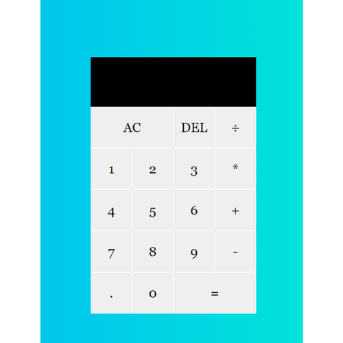

## Calculator

 Description: Every indiviadual element constructing an calculator is set on different button element inside the HTML file document. All of the button element is inside a div element who s perpose is to create the body of the calculator with all his buttons inside. 

The styling after that is created thanks to the CSS file document conected to the HTML. And finally for the functionality of the calculator i implemented some JacaScript code. 

